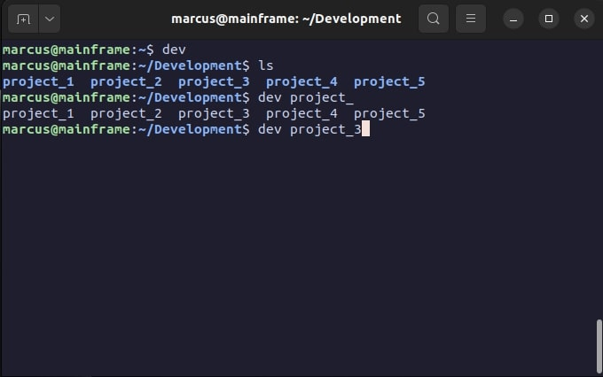

# Dev

A command line program to easily organize your projects and access them.

## Requirements

- Bash
- Git

## Tested

- **Ubuntu** on **22.04**
- **MacOS** (_with bash_) on **Sonoma 14.3**

_Other system configurations are untested, if you would like to contribute, open a pull request_

## Installation

### From Cloud

```bash
curl -s https://raw.githubusercontent.com/marcusfrdk/dev/main/install_from_cloud.sh | bash
```

### From Repository

```bash
git clone https://github.com/marcusfrdk/dev.git
cd dev
chmod +x install.sh
./install.sh
exec $SHELL
```

## Uninstallation

### From Cloud

```bash
curl -s https://raw.githubusercontent.com/marcusfrdk/dev/main/uninstall_from_cloud.sh | bash
```

### From Repository

```bash
chmod +x uninstall.sh
./uninstall.sh
exec $SHELL
```

_Note: This only removes the program from your session file, it DOES NOT remove your project folder._

## Usage

### Change Directory

Changes the current working directory to `DEV_BASEPATH` (Default is `~/Development`)

```bash
dev
```

### Open Project

Opens a specific project in your IDE of choice (Default is `nvim`)

```bash
dev {PROJECT}
```

_Note: Autocomplete using tab is supported_

## Configuration

### Values

```bash
DEV_IDE=nvim # the IDE to use, e.g. neovim, vscode, etc.
DEV_BASEPATH="$HOME/Development" # the base directory where you store your projects.
DEV_SHOULD_CLOSE=0 # 0=keep the shell open, 1=close the shell after the IDE process exits.
```

### In `config.sh`

After updating the config file, run the following commands to update the program:

```bash
./install.sh
exec $SHELL
```

### In session file (`.bashrc`, `.zshrc`, etc.)

After changing the values in your session file, refresh your session to update the program (`exec $SHELL`).

_Note: Values changed in your session file will be reset after the script `uninstall.sh` is run._
